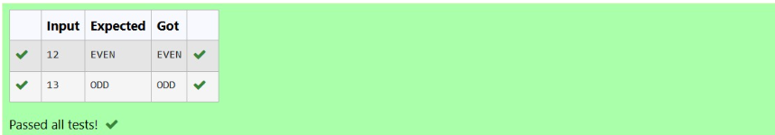
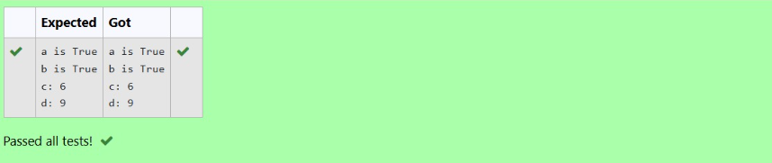
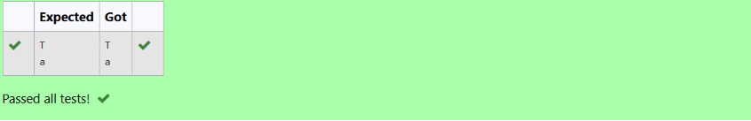
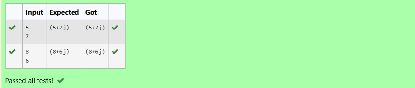
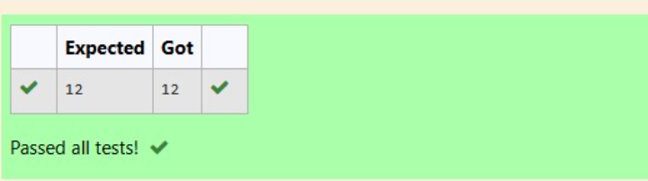

SHARMILI V(25011856)
1. Conditional Statements in Python: Even or Odd Checker
🎯 Aim
To write a Python program to check whether the given number is even or odd using if...else statements.

🧠 Algorithm
Get an input from the user.
Convert the input to an integer and store it in a variable a.
Use the modulo operator % to check if a % 2 == 0.
    If true, print "EVEN".
    Else, print "ODD".
End the program.

🧾 Program
a=int(input())
if a%2==0:
    print("EVEN")
else:
    print("ODD")

Output

Result
Successfully wrote a Python program to check whether the given number is even or odd using if...else statements.

2. Datatypes-Boolean Expression Evaluation in Python
🎯 Aim
To write a Python program that evaluates and prints the results of boolean and arithmetic expressions involving True and False.

🧠 Algorithm

Set variable a to the result of the expression 0 == True.
Set variable b to the result of the expression False == False.
Set variable c to the result of the expression True + True.
Set variable d to the result of the expression False + 9.
Print the value of a with the label "a is".
Print the value of b with the label "b is".
Print the value of c with the label "c:".
Print the value of d with the label "d:".

💻 Program

a=0==True
b=False==False 
c=True+True
d=False+9
print("a is",a)
print("b is",b)
print("c:",c)
print("d:",d)

Output

Result

Successfully wrote a Python program that evaluates and prints the results of boolean and arithmetic expressions involving True and False.

3. Datatypes-Character Literal in Python

🎯 Aim
To write a Python program that prints the characters 'T' and 'a' using character literals.

🧠 Algorithm
Print the character 'T'.
Print the character 'a'.

🧾 Program

x='T'
y='a'
print(x)
print(y)

Output

Result
Successfully wrote a Python program that prints the characters 'T' and 'a' using character literals.

4. Datatypes-Complex Number Creation in Python
🎯 Aim

To write a Python program that reads two integers, creates a complex number using them, and then prints the complex number along with its real and imaginary parts.

🧠 Algorithm

Read an integer input from the user and assign it to the variable a (real part).
Read another integer input from the user and assign it to the variable b (imaginary part).
Create a complex number x using the complex(a, b) function.
Print the complex number x.
Print the real part of x using x.real.
Print the imaginary part of x using x.imag.

💻 Program

a=int(input())
b=int(input())
x=complex(a,b)
print(x)
print(float(x.real))
print(float(x.imag))

Output

Result
Successfully wrote a Python program that reads two integers, creates a complex number using them, and then prints the complex number along with its real and imaginary parts.

5. Datatypes-Read and Print a String in Python
🎯 Aim

To write a Python program to read a string from the user and then print it.

🧠 Algorithm

Assign a variable named men_stepped_on_the_moon.
Use input() to read a string from the user and store it in the variable.
Print the value stored in the variable.

🧾 Program

men_stepped_on_the_moon=int(input())
print(men_stepped_on_the_moon)

Output

Result
Successfully wrote a Python program to read a string from the user and then print it.